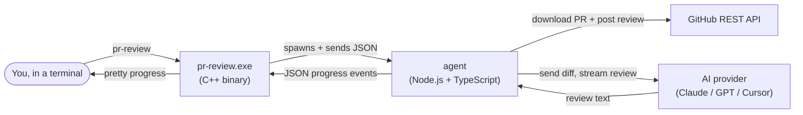

# pr-agent

`pr-review` is a command-line tool that posts AI-generated code reviews onto
GitHub pull requests for you. You point it at a PR URL, it downloads the PR,
asks an AI model (Anthropic Claude, OpenAI GPT, or Cursor's Composer) to
review the diff, and then it posts a real GitHub review back to the PR with
inline comments on the exact lines the model flagged.

```
$ pr-review https://github.com/acme/widgets/pull/42
? Provider:  > Anthropic Claude    OpenAI    Cursor
? Model:     > claude-opus-4.5
  Fetching PR ........... 12 files, 480 lines
  Reviewing ............. 3,210 tokens in, 580 tokens out
  Posting review ....... done

Posted review: https://github.com/acme/widgets/pull/42#pullrequestreview-...
```

---

## Table of contents

- [What this project actually is](#what-this-project-actually-is)
- [The big picture: how it works](#the-big-picture-how-it-works)
- [The pieces, one by one](#the-pieces-one-by-one)
- [Installation (Windows)](#installation-windows)
- [Configuration: telling the tool who you are](#configuration-telling-the-tool-who-you-are)
- [Your first review](#your-first-review)
- [Useful commands](#useful-commands)
- [Building from source](#building-from-source)
- [Repository layout](#repository-layout)
- [Troubleshooting](#troubleshooting)
- [Status and roadmap](#status-and-roadmap)
- [Licence](#licence)

---

## What this project actually is

If you have not used GitHub much yet, here is the one-paragraph version: a
**pull request** (PR) is a request to merge some new code into a project.
Reviewing PRs means reading the changed code and leaving comments. It is a
slow, manual job. `pr-agent` automates the first pass of that job using a
large language model (LLM) so that a human reviewer can skip straight to the
interesting bits.

You install one program (`pr-review`), give it a couple of API keys, and from
then on running `pr-review <pr-url>` is enough to land a review on GitHub.

> Note on words: an "LLM" or "AI model" here just means an external paid
> service such as Anthropic Claude or OpenAI GPT. We send the diff to them
> over HTTPS and they send back text. Nothing is "trained" on your code by
> this tool; we just call their public APIs.

---

## The big picture: how it works

The tool is split into **two programs that talk to each other**, plus the
outside world (GitHub and the AI provider). That sounds fancier than it is.
Here is the same idea as a picture:



Step by step, when you run `pr-review https://github.com/acme/widgets/pull/42`:

1. The **C++ binary** parses your arguments, reads a little bit of your
   config so it can show you the right menu, and (if needed) shows an
   interactive picker so you can choose which AI provider and model to use.
2. The C++ binary then **starts the Node agent as a subprocess**. Think of
   it as the binary opening another program in the background and keeping a
   private pipe to it.
3. The two halves talk over that pipe using **NDJSON** (newline-delimited
   JSON). One line of JSON = one message. The C++ side tells the agent what
   to do; the agent reports progress back as more JSON lines.
4. The **agent** authenticates to GitHub with your personal access token,
   downloads the PR's metadata and the unified diff, and chops the diff into
   sensible chunks if it is very large.
5. The agent calls the **AI provider's API** with a prompt built from the
   diff. It streams the response, counts tokens (the unit AI providers bill
   in), and reports the running totals back to the CLI so you see a live
   progress line.
6. Once the AI returns a structured JSON response (a summary plus a list of
   inline comments), the agent **posts a real GitHub review** using the same
   token. The review URL ends up on stdout for you to click.

If the agent hits any problem (bad token, model timeout, GitHub 403, etc.)
it sends an `error` message instead of a `result`, and the CLI shows that
to you with the right exit code.

For the full protocol specification and the list of message types, see
[docs/ARCHITECTURE.md](docs/ARCHITECTURE.md).

### Why two halves and not one?

A reasonable question. We split them because each half is good at something
the other one is bad at:

- **C++ (the CLI)** ships as a single small `.exe`. It starts instantly,
  draws a nice TUI (terminal user interface) using FTXUI, and does not need
  Node.js to launch. That means you can put `pr-review` on PATH and forget
  about it.
- **TypeScript (the agent)** has first-class SDKs for GitHub, Anthropic,
  OpenAI and Cursor, plus easy JSON parsing and validation with Zod. Doing
  the same thing in C++ would be a nightmare.

So the binary is the "front of house" and the agent is the "kitchen". They
exchange JSON because JSON is trivial to produce and consume on both sides.

---

## The pieces, one by one

If you open the repo, here is what you are looking at and what each folder
is for:

- **`cli/`** — The C++20 source for the `pr-review` binary. It is built
  with CMake and uses vcpkg to fetch its small set of dependencies (FTXUI
  for the TUI, nlohmann/json for JSON, etc.).
- **`agent/`** — A Node.js + TypeScript workspace, managed with `pnpm`.
  This is where all the interesting logic lives: GitHub access, the AI
  provider implementations, the prompt templates, config loading, the
  NDJSON protocol, and the standalone CLI mode (so you can run the agent
  directly with `node dist/index.js …` for debugging, without the C++ side).
- **`installer/`** — A single PowerShell script, `install.ps1`, that copies
  the binary and the agent into `%LOCALAPPDATA%\pr-agent\`, adds that
  folder to your user `PATH`, and verifies Node 22+ is installed. It also
  has an `-Uninstall` switch.
- **`docs/`** — Long-form documentation: architecture, installation
  details, and a complete config reference.
- **`.github/`** — Continuous integration (CI) and release workflows.

The two halves are completely independent: you can build either one without
the other, and you can run the agent on its own without the C++ binary if
you ever want to script it (it speaks NDJSON on stdin/stdout).

---

## Installation (Windows)

The supported way to install `pr-review` today is from a prebuilt release
zip. macOS and Linux installers are deferred for now (the source already
builds on both — see [Building from source](#building-from-source)).

### 1. Check your prerequisites

| You need | Minimum | How to check |
| -------- | ------- | ------------ |
| Windows | 10 or 11 | `winver` |
| Node.js | 22 LTS  | `node --version` |
| PowerShell | 5.1+ | `$PSVersionTable.PSVersion` |

If Node is missing or older than 22, install the LTS build from
[nodejs.org](https://nodejs.org/en/download) or, if you like the command
line:

```powershell
winget install OpenJS.NodeJS.LTS
```

Node is required because the agent is a Node program. The C++ binary on its
own cannot review anything; it needs the agent next to it.

### 2. Grab a release

1. Open the project's
   [releases page](https://github.com/your-org/pr-agent/releases).
2. Download `pr-agent-windows-x64.zip` from the latest release.
3. Right-click the zip and choose **Extract All**. Pick any folder you
   like; the installer will move things into the right place.

### 3. Run the installer

Open a normal (not elevated) PowerShell window inside the extracted folder
and run:

```powershell
.\installer\install.ps1
```

The script does four things:

1. Copies `pr-review.exe` and the `agent\` folder into
   `%LOCALAPPDATA%\pr-agent\`. That is your user's local app data, so no
   admin rights are needed.
2. Adds `%LOCALAPPDATA%\pr-agent\` to your **user** `PATH` (not the system
   `PATH`). This is what lets you type `pr-review` from any terminal.
3. Confirms you have Node 22+ on `PATH`, and warns you (without failing)
   if not.
4. Locks down `~\.pr-agent\config.toml` so other Windows accounts on the
   same machine cannot read your tokens, if the file exists yet.

To uninstall later, run the same script with `-Uninstall`:

```powershell
.\installer\install.ps1 -Uninstall
```

### 4. Open a fresh terminal

`PATH` updates are only picked up by **new** terminals, so close and
reopen PowerShell, then sanity-check:

```powershell
pr-review --version
```

If you see a version number, the binary and the agent are wired up
correctly. If you get "command not found", your new terminal is not
seeing the updated `PATH` — try logging out and back in.

For a more detailed walkthrough (including the long version of every step
above), see [docs/INSTALL.md](docs/INSTALL.md).

---

## Configuration: telling the tool who you are

Before `pr-review` can do anything useful it needs three things:

1. A **GitHub Personal Access Token (PAT)** so it can read the PR and post
   the review on your behalf.
2. At least one **AI provider API key** (Anthropic, OpenAI, or Cursor).
3. Optional default settings (your favourite provider, model, whether to
   post or just dry-run, etc.).

All of that lives in a single TOML file at `~\.pr-agent\config.toml`
(`%USERPROFILE%\.pr-agent\config.toml` on Windows). The easiest way to
create it is the interactive scaffold:

```powershell
pr-review init
```

That writes a template config with placeholders and opens it in your
default editor. Fill in the placeholders and save.

A trimmed example:

```toml
[github]
token = "ghp_replace_me"          # see below for how to mint one

[providers.anthropic]
api_key = "sk-ant-replace-me"
default_model = "claude-opus-4.5"

[providers.openai]
api_key = "sk-replace-me"
default_model = "gpt-5"

[defaults]
post_review = true                # set to false to dry-run by default
```

### Minting a GitHub PAT

1. Visit <https://github.com/settings/tokens>.
2. Choose **Personal access tokens (classic)** then
   **Generate new token (classic)**.
3. Tick the `repo` scope so the tool can read private PRs and post
   reviews. (If you only ever review public repos, `public_repo` is
   enough.)
4. Copy the token immediately — GitHub only shows it once — and paste it
   into `config.toml`.

Fine-grained tokens also work: grant **Pull requests: read and write**
plus **Contents: read** on the repos you want to review.

The full reference, including base-URL overrides for Azure / proxies, is
in [docs/CONFIG.md](docs/CONFIG.md).

### Environment variables (optional)

You do not have to keep secrets in `config.toml`. If any of these are set
when `pr-review` starts, they take priority:

- GitHub token: `PR_AGENT_GITHUB_TOKEN`, `GITHUB_TOKEN`, `GH_TOKEN`
- Anthropic: `ANTHROPIC_API_KEY` or `PR_AGENT_ANTHROPIC_KEY`
- OpenAI: `OPENAI_API_KEY` or `PR_AGENT_OPENAI_KEY`
- Cursor: `CURSOR_API_KEY` or `PR_AGENT_CURSOR_KEY`
- Default provider: `PR_AGENT_PROVIDER`

A `.env` file in your current working directory is also loaded
automatically. This is handy for CI or for keeping per-project credentials.

---

## Your first review

```powershell
pr-review https://github.com/<owner>/<repo>/pull/<number>
```

You will be prompted to pick a provider and model unless you have set
`[defaults]` in your config. Then you will see a live progress line as the
agent fetches, chunks, reviews and posts. When it finishes, it prints the
URL of the review it just posted.

If you want to **see what it would say before posting**, add `--dry`:

```powershell
pr-review https://github.com/<owner>/<repo>/pull/<number> --dry
```

That runs the whole pipeline but skips the final step. The summary is
printed to your terminal and nothing is sent back to GitHub.

---

## Useful commands

```powershell
pr-review init                       # interactive: GitHub token + provider + key
pr-review providers                  # list providers and models known to the agent
pr-review <pr-url>                   # default flow: review + post
pr-review <pr-url> --dry             # run the review without posting
pr-review <pr-url> -p anthropic -m claude-opus-4.5
pr-review --verbose <pr-url>         # surface agent debug logs on stderr
pr-review --help                     # full usage
```

`--verbose` is the one to reach for if something looks wrong: it streams
the agent's `log` events to stderr so you can see exactly which step failed
and why.

---

## Building from source

You only need this section if you want to hack on `pr-agent` itself.

### Agent (Node + TypeScript)

From the repo root:

```powershell
pnpm install
pnpm -F agent build
```

This produces `agent/dist/index.js`. To re-run on every change, use
`pnpm -F agent dev` instead, which keeps `tsc --watch` running.

### CLI (C++)

You will need:

- CMake 3.25+
- A C++20 compiler (MSVC on Windows, GCC 12+ on Linux, Clang 15+ on macOS)
- vcpkg (clone it anywhere on disk, then set the `VCPKG_ROOT` environment
  variable to its path)

Then:

```powershell
cd cli
cmake --preset windows-x64
cmake --build --preset windows-x64 --config Release
```

The compiled binary lands at
`cli\build\windows-x64\Release\pr-review.exe`.

### Putting it together for local dev

When you run the binary out of its build directory, it does not know where
to find the agent. Point it at your local build with an environment
variable:

```powershell
$env:PR_AGENT_AGENT_PATH = "C:\path\to\pr-agent\agent\dist\index.js"
.\cli\build\windows-x64\Release\pr-review.exe --version
```

In a packaged release the agent ships next to the binary and the CLI
resolves it relative to its own executable, so you do not need to set
anything.

There is more detail (including the full IPC protocol) in
[docs/ARCHITECTURE.md](docs/ARCHITECTURE.md).

---

## Repository layout

| Path         | Contents                                                     |
| ------------ | ------------------------------------------------------------ |
| `cli/`       | The C++20 binary, built with CMake + vcpkg.                  |
| `agent/`     | The Node + TypeScript backend, built with `pnpm` and `tsc`.  |
| `installer/` | PowerShell installer for Windows.                            |
| `docs/`      | User-facing and architectural documentation.                 |
| `bin/`       | Convenience launchers used during local development.         |
| `.github/`   | CI and release workflows.                                    |

---

## Troubleshooting

A few problems that come up often:

- **"`pr-review` is not recognised"** — Your terminal has a stale `PATH`.
  Close every PowerShell / Terminal window and open a new one. If that
  still does not work, sign out of Windows and back in.
- **"Node 22 or newer was not found on PATH"** — Install Node 22 LTS (see
  [Installation](#installation-windows)). After installing, open a new
  terminal so `node` is picked up.
- **`PROVIDER_NOT_CONFIGURED`** — The agent could not find an API key for
  the provider you chose. Either fill in `providers.<id>.api_key` in
  `config.toml` or set the matching environment variable.
- **GitHub `403` or `404`** — Almost always a token scope problem. Your
  PAT needs at least `repo` (classic) or **Pull requests: read and write**
  + **Contents: read** (fine-grained) on the target repo.
- **Want to see exactly what is happening?** — Re-run with `--verbose`.
  The agent's debug logs will appear on stderr.

If you are testing changes you have made yourself, [TESTING.md](TESTING.md)
has a full manual test plan covering both halves.

---

## Status and roadmap

`pr-agent` v1 is Windows-first. The C++ and TypeScript code is already
portable, so adding macOS and Linux installers is mostly a CI job — see
[docs/ARCHITECTURE.md](docs/ARCHITECTURE.md) for the full "in scope" and
"deferred" lists.

---

## Licence

MIT. See [LICENSE](LICENSE).
