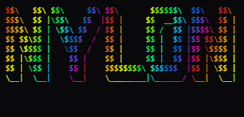
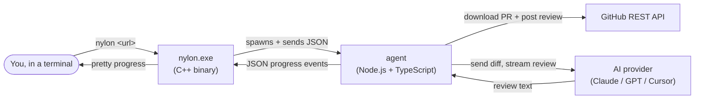

<p align="center">
  
</p>

<p align="center">
  <em>A CLI Tool &mdash; AI pull-request reviews on GitHub, with task-tracker sync on the way.</em>
</p>

<p align="center">
  <a href="#installation-windows"><strong>Install</strong></a> &middot;
  <a href="#your-first-review"><strong>First review</strong></a> &middot;
  <a href="#review-skills-the-3-pass-pipeline"><strong>Skills</strong></a> &middot;
  <a href="#interactive-menu"><strong>Menu</strong></a> &middot;
  <a href="docs/ARCHITECTURE.md"><strong>Architecture</strong></a>
</p>

---

# Nylon (`nylon`)

`nylon` is a command-line tool that posts AI-generated code reviews onto
GitHub pull requests for you. Point it at a PR URL, it downloads the PR, asks
an AI model (Anthropic Claude, OpenAI GPT, or Cursor's Composer) to review the
diff, and then posts a real GitHub review back with inline comments on the
exact lines the model flagged.

When you enable the built-in **review skills**, that single call fans out into
a three-pass pipeline (intent &rarr; inline comments &rarr; synthesis) which
produces noticeably tighter, less hallucinated reviews on bigger PRs.

```
$ nylon https://github.com/acme/widgets/pull/42
? Provider:  > Cursor    Anthropic Claude    OpenAI
? Model:     > composer-2
  Fetching PR ............ 12 files, 480 lines
  pass 1/3: intent analysis
  pass 2/3: inline review
  pass 3/3: synthesis
  Posting review ......... done   (label: needs-fixes)

Posted review: https://github.com/acme/widgets/pull/42#pullrequestreview-...
```

---

## Table of contents

- [What this project actually is](#what-this-project-actually-is)
- [The big picture: how it works](#the-big-picture-how-it-works)
- [Review skills: the 3-pass pipeline](#review-skills-the-3-pass-pipeline)
- [Interactive menu](#interactive-menu)
- [The pieces, one by one](#the-pieces-one-by-one)
- [Installation (Windows)](#installation-windows)
- [Configuration: telling the tool who you are](#configuration-telling-the-tool-who-you-are)
- [Your first review](#your-first-review)
- [Useful commands](#useful-commands)
- [Building from source](#building-from-source)
- [Repository layout](#repository-layout)
- [Troubleshooting](#troubleshooting)
- [Status and roadmap](#status-and-roadmap)
- [Licence](#licence)

---

## What this project actually is

If you have not used GitHub much yet, here is the one-paragraph version: a
**pull request** (PR) is a request to merge some new code into a project.
Reviewing PRs means reading the changed code and leaving comments. It is a
slow, manual job. Nylon automates the first pass of that job using a large
language model (LLM) so that a human reviewer can skip straight to the
interesting bits.

You install one program (`nylon`), give it a couple of API keys, and from
then on running `nylon <pr-url>` is enough to land a review on GitHub.

> Note on words: an "LLM" or "AI model" here just means an external paid
> service such as Anthropic Claude or OpenAI GPT. We send the diff to them
> over HTTPS and they send back text. Nothing is "trained" on your code by
> this tool; we just call their public APIs.

---

## The big picture: how it works

The tool is split into **two programs that talk to each other**, plus the
outside world (GitHub and the AI provider). That sounds fancier than it is.
Here is the same idea as a picture:



Step by step, when you run `nylon https://github.com/acme/widgets/pull/42`:

1. The **C++ binary** parses your arguments, reads a little bit of your
   config so it can show you the right menu, and (if needed) shows an
   interactive picker so you can choose which AI provider and model to use.
2. The C++ binary then **starts the Node agent as a subprocess**. Think of
   it as the binary opening another program in the background and keeping a
   private pipe to it.
3. The two halves talk over that pipe using **NDJSON** (newline-delimited
   JSON). One line of JSON = one message. The C++ side tells the agent what
   to do; the agent reports progress back as more JSON lines.
4. The **agent** authenticates to GitHub with your personal access token,
   downloads the PR's metadata and the unified diff, and chops the diff into
   sensible chunks if it is very large.
5. The agent calls the **AI provider's API** with a prompt built from the
   diff. If you have enabled the review skills it runs the three-pass
   pipeline described below; otherwise it does a single combined pass. Either
   way it streams the response, counts tokens, and reports progress back to
   the CLI so you see a live progress line.
6. Once the AI returns a structured JSON response (a summary plus a list of
   inline comments), the agent **posts a real GitHub review** using the same
   token. The review URL ends up on stdout for you to click.

If the agent hits any problem (bad token, model timeout, GitHub 403, etc.)
it sends an `error` message instead of a `result`, and the CLI shows that
to you with the right exit code.

For the full protocol specification and the list of message types, see
[docs/ARCHITECTURE.md](docs/ARCHITECTURE.md).

### Why two halves and not one?

A reasonable question. We split them because each half is good at something
the other one is bad at:

- **C++ (the CLI)** ships as a single small `.exe`. It starts instantly,
  draws a nice TUI (terminal user interface) using FTXUI, and does not need
  Node.js to launch. That means you can put `nylon` on PATH and forget
  about it.
- **TypeScript (the agent)** has first-class SDKs for GitHub, Anthropic,
  OpenAI and Cursor, plus easy JSON parsing and validation with Zod. Doing
  the same thing in C++ would be a nightmare.

So the binary is the "front of house" and the agent is the "kitchen". They
exchange JSON because JSON is trivial to produce and consume on both sides.

---

## Review skills: the 3-pass pipeline

Out of the box the agent ships with three **review skills** that, when
turned on together, replace the single "do everything at once" prompt with
a structured pipeline. Each pass is a focused prompt that hands its output
to the next pass:

| # | Skill ID            | What it does                                                                              |
| - | ------------------- | ----------------------------------------------------------------------------------------- |
| 1 | `intent-analysis`   | Looks only at the PR title, description and file list, and writes a short intent doc.     |
| 2 | `inline-reviewer`   | Reads the intent doc plus the unified diff and emits the inline comments (one per issue). |
| 3 | `review-synthesis`  | Takes the intent doc and the comment list and produces the summary, risk level, follow-ups. |

The skills live in [`agent/src/skills/`](agent/src/skills/) and each one
contributes its own system-prompt block. Activating all three on the
**Cursor** provider switches the agent into pipeline mode automatically.
On Anthropic / OpenAI the skills still tighten the single-pass prompt &mdash;
full pipeline support for those providers is on the roadmap.

Enable them in `~\.nylon\config.toml`:

```toml
[review]
# Add any subset. Activate all three for the full pipeline on Cursor.
skills = ["intent-analysis", "inline-reviewer", "review-synthesis"]

# Use REQUEST_CHANGES (which blocks merge) instead of plain COMMENT when the
# model flags an "issue" severity comment or sets risk level to "high".
request_changes_on_issue = false

# Auto-apply GitHub labels derived from the review. Labels must already
# exist on the repository or they are silently skipped:
#   - high-risk          (when riskLevel == "high")
#   - needs-fixes        (any "issue" severity comment)
#   - follow-up-needed   (any follow-up tasks were suggested)
labels = false
```

Browse the catalogue interactively with:

```powershell
nylon menu
# -> Skills -> pick one to see its description and ID
```

---

## Interactive menu

If you do not want to remember every flag, run:

```powershell
nylon
```

(`nylon menu` does the same thing.)

That opens a top-level menu with the animated NYLON banner and three
sections:

- **PR agent** &mdash; **Review a pull request** asks for a PR URL and runs
  the same pipeline as `nylon review <url>`.
- **Task exporter** &mdash; **ClickUp** export is live when
  `[integrations.clickup]` is present in `config.toml` with a real token
  (including when `nylon init` writes that block after reading
  `CLICKUP_API_KEY` or `NYLON_CLICKUP_TOKEN`). You pick a document path
  (Markdown, PDF, Word, or plain text), the agent runs a fixed five-stage
  extraction pipeline, then confirms before creating tasks in your chosen
  list. Without a token in config, Nylon falls back to the scripted demo
  flow so the UX is still easy to try. Monday.com and Jira are not wired
  up yet.
- **Skills** &mdash; browse every skill in the catalogue (GitHub review
  lenses and the stages of the task-extraction pipeline), with descriptions
  and config hints. Review skills are toggled with `[review].skills`; the
  SOW &rarr; ClickUp pipeline always runs the same five agents in order
  (you cannot enable individual extraction stages in config).

Arrow keys (or number shortcuts) navigate, Enter confirms, Ctrl+C exits.
The menu requires an interactive terminal &mdash; on CI it falls back to
"please use the subcommands directly".

---

## The pieces, one by one

If you open the repo, here is what you are looking at and what each folder
is for:

- **`cli/`** &mdash; The C++20 source for the `nylon` binary. It is
  built with CMake and uses vcpkg to fetch its small set of dependencies
  (FTXUI for the TUI, nlohmann/json for JSON, etc.).
- **`agent/`** &mdash; A Node.js + TypeScript workspace, managed with
  `pnpm`. This is where all the interesting logic lives: GitHub access,
  the AI provider implementations, the review skills and pipeline
  prompts, config loading, the NDJSON protocol, and the standalone CLI
  mode (so you can run the agent directly with `node dist/index.js ...`
  for debugging, without the C++ side).
- **`installer/`** &mdash; A single PowerShell script, `install.ps1`,
  that copies the binary and the agent into `%LOCALAPPDATA%\nylon\`,
  adds that folder to your user `PATH`, and verifies Node 22+ is
  installed. It also has an `-Uninstall` switch.
- **`docs/`** &mdash; Long-form documentation: architecture, installation
  details, and a complete config reference.
- **`.github/`** &mdash; Continuous integration (CI) and release
  workflows.

The two halves are completely independent: you can build either one
without the other, and you can run the agent on its own without the C++
binary if you ever want to script it (it speaks NDJSON on stdin/stdout).

---

## Installation (Windows)

The supported way to install `nylon` today is from a prebuilt release
zip. macOS and Linux installers are deferred for now (the source already
builds on both &mdash; see [Building from source](#building-from-source)).

### 1. Check your prerequisites

| You need | Minimum | How to check |
| -------- | ------- | ------------ |
| Windows | 10 or 11 | `winver` |
| Node.js | 22 LTS  | `node --version` |
| PowerShell | 5.1+ | `$PSVersionTable.PSVersion` |

If Node is missing or older than 22, install the LTS build from
[nodejs.org](https://nodejs.org/en/download) or, if you like the command
line:

```powershell
winget install OpenJS.NodeJS.LTS
```

Node is required because the agent is a Node program. The C++ binary on
its own cannot review anything; it needs the agent next to it.

### 2. Grab a release

1. Open the project's
   [releases page](https://github.com/elefinnt/nylon/releases).
2. Download `nylon-windows-x64.zip` from the latest release.
3. Right-click the zip and choose **Extract All**. Pick any folder you
   like; the installer will move things into the right place.

### 3. Run the installer

Open a normal (not elevated) PowerShell window inside the extracted folder
and run:

```powershell
.\installer\install.ps1
```

The script does four things:

1. Copies `nylon.exe` and the `agent\` folder into
   `%LOCALAPPDATA%\nylon\`. That is your user's local app data, so no
   admin rights are needed.
2. Adds `%LOCALAPPDATA%\nylon\` to your **user** `PATH` (not the
   system `PATH`). This is what lets you type `nylon` from any
   terminal.
3. Confirms you have Node 22+ on `PATH`, and warns you (without failing)
   if not.
4. Locks down `~\.nylon\config.toml` so other Windows accounts on the
   same machine cannot read your tokens, if the file exists yet.

To uninstall later, run the same script with `-Uninstall`:

```powershell
.\installer\install.ps1 -Uninstall
```

### 4. Open a fresh terminal

`PATH` updates are only picked up by **new** terminals, so close and
reopen PowerShell, then sanity-check:

```powershell
nylon --version
```

If you see a version number, the binary and the agent are wired up
correctly. If you get "command not found", your new terminal is not
seeing the updated `PATH` &mdash; try logging out and back in.

For a more detailed walkthrough (including the long version of every
step above), see [docs/INSTALL.md](docs/INSTALL.md).

---

## Configuration: telling the tool who you are

Before `nylon` can do anything useful it needs three things:

1. A **GitHub Personal Access Token (PAT)** so it can read the PR and
   post the review on your behalf.
2. At least one **AI provider API key** (Cursor, Anthropic, or OpenAI).
3. Optional default settings (your favourite provider, model, whether to
   post or just dry-run, which review skills to enable, etc.).

All of that lives in a single TOML file at `~\.nylon\config.toml`
(`%USERPROFILE%\.nylon\config.toml` on Windows). The easiest way to
create it is the interactive scaffold:

```powershell
nylon init
```

That writes a template config with placeholders and opens it in your
default editor. Fill in the placeholders and save.

A trimmed example:

```toml
[github]
token = "ghp_replace_me"

[providers.cursor]
api_key = "cursor_replace_me"
default_model = "composer-2"

[providers.anthropic]
api_key = "sk-ant-replace_me"
default_model = "claude-opus-4.5"

[providers.openai]
api_key = "sk-replace_me"
default_model = "gpt-5"

[defaults]
post_review = true

[review]
# Activate the full 3-pass pipeline on Cursor (also tightens single-pass
# prompts on Anthropic / OpenAI).
skills = ["intent-analysis", "inline-reviewer", "review-synthesis"]
request_changes_on_issue = false
labels = false

# Optional — Task exporter → ClickUp (personal API token from ClickUp → Settings → Apps).
# [integrations.clickup]
# token = "pk_replace_me"
# default_list_id = ""   # optional: skip the list picker

[extract]
# Controls how documents are read before the fixed five-agent SOW pipeline.
# include = ["md", "pdf", "docx", "txt"]
# pdf_strategy = "auto"   # auto | text | vision
# max_chars_per_doc = 80000
```

### Minting a GitHub PAT

1. Visit <https://github.com/settings/tokens>.
2. Choose **Personal access tokens (classic)** then
   **Generate new token (classic)**.
3. Tick the `repo` scope so the tool can read private PRs and post
   reviews. (If you only ever review public repos, `public_repo` is
   enough.)
4. Copy the token immediately &mdash; GitHub only shows it once &mdash;
   and paste it into `config.toml`.

Fine-grained tokens also work: grant **Pull requests: read and write**
plus **Contents: read** on the repos you want to review.

The full reference, including base-URL overrides for Azure / proxies, is
in [docs/CONFIG.md](docs/CONFIG.md). That file may lag slightly behind the
template emitted by `nylon init`; when in doubt, match the comments in your
on-disk `config.toml`.

### Task exporter (ClickUp) and `[extract]`

The **Task exporter** path reads a local document, runs **five** AI stages
in a fixed order (intelligence &rarr; architect &rarr; planner &rarr;
ticket generator &rarr; quality), then optionally pushes the resulting
tree to **ClickUp**. You cannot reorder or subset those stages via
`config.toml`; an older `extract.skills` field, if present, is accepted
and ignored for backwards compatibility.

| Section                      | Purpose                                                                 |
| ---------------------------- | ----------------------------------------------------------------------- |
| `[integrations.clickup]`     | `token` (required for live export), optional `default_list_id` to skip list picking. |
| `[extract]`                  | `include` (file extensions to ingest), `pdf_strategy` (`auto` tries text first), `max_chars_per_doc` (cap per document). |

### Environment variables (optional)

You do not have to keep secrets in `config.toml`. If any of these are
set when `nylon` starts, they take priority:

- GitHub token: `NYLON_GITHUB_TOKEN`, `GITHUB_TOKEN`, `GH_TOKEN`
- Anthropic: `ANTHROPIC_API_KEY` or `NYLON_ANTHROPIC_KEY`
- OpenAI: `OPENAI_API_KEY` or `NYLON_OPENAI_KEY`
- Cursor: `CURSOR_API_KEY` or `NYLON_CURSOR_KEY`
- ClickUp: `CLICKUP_API_KEY` or `NYLON_CLICKUP_TOKEN` (picked up by
  **`nylon init`** so the token can be written into `config.toml`; the Task
  exporter still reads `[integrations.clickup]` from the file, not the live
  environment alone)
- Default provider: `NYLON_PROVIDER`

A `.env` file in your current working directory is also loaded
automatically. This is handy for CI or for keeping per-project
credentials.

---

## Your first review

```powershell
nylon https://github.com/<owner>/<repo>/pull/<number>
```

You will be prompted to pick a provider and model unless you have set
`[defaults]` in your config. Then you will see a live progress line as
the agent fetches, chunks, reviews and posts. When it finishes, it
prints the URL of the review it just posted.

If you want to **see what it would say before posting**, add `--dry`:

```powershell
nylon https://github.com/<owner>/<repo>/pull/<number> --dry
```

That runs the whole pipeline but skips the final step. The summary is
printed to your terminal and nothing is sent back to GitHub.

The posted review is signed `_Reviewed by Nylon._` at the bottom so
collaborators can tell it apart from human review comments at a glance.

---

## Useful commands

```powershell
nylon                            # interactive: NYLON main menu (same as menu)
nylon menu                       # same as bare nylon
nylon init                       # interactive: GitHub token + provider + key
nylon providers                  # list providers and models known to the agent
nylon <pr-url>                   # default flow: review + post
nylon <pr-url> --dry             # run the review without posting
nylon <pr-url> -p anthropic -m claude-opus-4.5
nylon --verbose <pr-url>         # surface agent debug logs on stderr
nylon --help                     # full usage
nylon help review                # focused help on a specific subcommand
```

`--verbose` is the one to reach for if something looks wrong: it streams
the agent's `log` events to stderr so you can see exactly which step
failed and why.

---

## Building from source

You only need this section if you want to hack on Nylon itself.

### Agent (Node + TypeScript)

From the repo root:

```powershell
pnpm install
pnpm -F agent build
```

This produces `agent/dist/index.js`. To re-run on every change, use
`pnpm -F agent dev` instead, which keeps `tsc --watch` running. The full
unit-test suite (including the skills tests) is run with:

```powershell
pnpm -F agent test
```

### CLI (C++)

You will need:

- CMake 3.25+
- A C++20 compiler (MSVC on Windows, GCC 12+ on Linux, Clang 15+ on
  macOS)
- vcpkg (clone it anywhere on disk, then set the `VCPKG_ROOT`
  environment variable to its path)

Then:

```powershell
cd cli
cmake --preset windows-x64
cmake --build --preset windows-x64 --config Release
```

The compiled binary lands at
`cli\build\windows-x64\Release\nylon.exe`.

### Putting it together for local dev

When you run the binary out of its build directory, it does not know
where to find the agent. Point it at your local build with an
environment variable:

```powershell
$env:NYLON_AGENT_PATH = "C:\path\to\nylon\agent\dist\index.js"
.\cli\build\windows-x64\Release\nylon.exe --version
```

In a packaged release the agent ships next to the binary and the CLI
resolves it relative to its own executable, so you do not need to set
anything.

There is more detail (including the full IPC protocol) in
[docs/ARCHITECTURE.md](docs/ARCHITECTURE.md).

---

## Repository layout

| Path         | Contents                                                     |
| ------------ | ------------------------------------------------------------ |
| `cli/`       | The C++20 binary, built with CMake + vcpkg.                  |
| `agent/`     | The Node + TypeScript backend, built with `pnpm` and `tsc`.  |
| `installer/` | PowerShell installer for Windows.                            |
| `docs/`      | User-facing and architectural documentation.                 |
| `bin/`       | Convenience launchers used during local development.         |
| `.github/`   | CI and release workflows.                                    |

Inside `agent/src/`, the modules that most often come up in discussion
are:

| Path                            | What lives here                                                  |
| ------------------------------- | ---------------------------------------------------------------- |
| `cli/menu/`                     | The interactive NYLON main menu and its sub-menus.               |
| `cli/anim/`                     | Banner, spinner, progress bar, checklist and typewriter helpers. |
| `skills/`                       | Skill type, registry, review skills and SOW pipeline stages.     |
| `integrations/clickup/`         | ClickUp API client, list picker and export flow.                 |
| `pipeline/`                     | PR review orchestration and document extraction (SOW pipeline). |
| `providers/`                    | Anthropic, OpenAI and Cursor adapters + prompt builders.         |
| `providers/prompts/pipeline.ts` | The three-pass intent / inline / synthesis prompts.              |
| `github/review.ts`              | Posting reviews, deriving labels and the REQUEST_CHANGES path.   |

---

## Troubleshooting

A few problems that come up often:

- **"`nylon` is not recognised"** &mdash; Your terminal has a stale
  `PATH`. Close every PowerShell / Terminal window and open a new one.
  If that still does not work, sign out of Windows and back in.
- **"Node 22 or newer was not found on PATH"** &mdash; Install Node 22
  LTS (see [Installation](#installation-windows)). After installing,
  open a new terminal so `node` is picked up.
- **`PROVIDER_NOT_CONFIGURED`** &mdash; The agent could not find an API
  key for the provider you chose. Either fill in
  `providers.<id>.api_key` in `config.toml` or set the matching
  environment variable.
- **Skill in `[review].skills` not recognised** &mdash; The agent logs a
  warning and ignores it. Run `nylon menu` &rarr; **Skills** to see
  the canonical IDs.
- **`nylon menu` says "this command needs an interactive terminal"**
  &mdash; You are running inside CI or with redirected stdin. Use the
  subcommands (`init`, `review`, `providers`) directly.
- **GitHub `403` or `404`** &mdash; Almost always a token scope problem.
  Your PAT needs at least `repo` (classic) or **Pull requests: read and
  write** + **Contents: read** (fine-grained) on the target repo.
- **Want to see exactly what is happening?** &mdash; Re-run with
  `--verbose`. The agent's debug logs will appear on stderr.

If you are testing changes you have made yourself, [TESTING.md](TESTING.md)
has a full manual test plan covering both halves.

---

## Status and roadmap

Nylon is Windows-first and PR-review-first. Recently landed:

- 3-pass review pipeline (`intent-analysis` &rarr; `inline-reviewer`
  &rarr; `review-synthesis`) on the Cursor provider.
- `[review]` config block with `skills`, `labels`, and
  `request_changes_on_issue`.
- Auto-derived labels (`high-risk`, `needs-fixes`, `follow-up-needed`)
  and a `REQUEST_CHANGES` event when severity warrants it.
- Interactive `nylon menu` with PR agent, Task exporter and Skills
  sections, animated banner, and live regions for in-place redraws.
- **ClickUp** export from the Task exporter when `[integrations.clickup]`
  is configured, backed by a fixed five-agent document pipeline and
  `[extract]` ingestion options.

Coming next:

- Full 3-pass pipeline on Anthropic and OpenAI (today they take the
  skills as system-prompt hints but still run a single combined call).
- Monday.com and Jira exporters (ClickUp is live; those remain to be
  implemented).
- macOS and Linux installers (the C++ and TypeScript code is already
  portable; this is mostly a CI job &mdash; see
  [docs/ARCHITECTURE.md](docs/ARCHITECTURE.md) for the full "in scope"
  and "deferred" lists).

---

## Licence

MIT. See [LICENSE](LICENSE).
