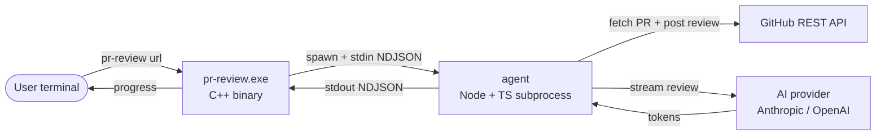

# Architecture

## High level



The C++ binary is responsible for:

- Argument parsing.
- Loading `~/.pr-agent/config.toml` for early validation.
- The interactive provider / model picker (FTXUI).
- Spawning the agent subprocess and rendering its progress.

The Node agent is responsible for:

- Talking to GitHub (`@octokit/rest`).
- Talking to AI providers (`@anthropic-ai/sdk`, `openai`).
- Building prompts, validating the model output, posting the review back.

## IPC protocol (NDJSON)

The CLI sends one JSON object per line to the agent's standard input. The
agent writes one JSON object per line back to its standard output. Standard
error is reserved for human-readable debug logs and is only surfaced to the
user with `--verbose`.

A worked example:

```
CLI -> agent : {"type":"listProviders"}
agent -> CLI : {"type":"providers","providers":[{"id":"anthropic","displayName":"Anthropic Claude","models":[...]}]}
CLI -> agent : {"type":"review","url":"https://github.com/a/b/pull/1","provider":"anthropic","model":"claude-opus-4.5","postReview":true}
agent -> CLI : {"type":"progress","stage":"fetching","detail":"a/b#1"}
agent -> CLI : {"type":"progress","stage":"reviewing","tokensIn":3210,"tokensOut":214}
agent -> CLI : {"type":"result","ok":true,"reviewUrl":"https://github.com/a/b/pull/1#pullrequestreview-..."}
```

### Requests (CLI -> agent)

| `type`           | Fields                                                   |
| ---------------- | -------------------------------------------------------- |
| `ping`           | none                                                     |
| `listProviders`  | none                                                     |
| `review`         | `url`, `provider`, `model`, `postReview?`                |
| `init`           | `path` (target config.toml path)                         |
| `cancel`         | none                                                     |

### Responses (agent -> CLI)

| `type`        | Fields                                                                   |
| ------------- | ------------------------------------------------------------------------ |
| `pong`        | `version`                                                                |
| `providers`   | `providers[]` each with `id`, `displayName`, `models[]`                  |
| `progress`    | `stage`, `detail?`, `tokensIn?`, `tokensOut?`                            |
| `log`         | `level`, `message`                                                       |
| `result`      | `ok`, `reviewUrl?`, `summary?`                                           |
| `error`       | `code`, `message`, `details?`                                            |

### Progress stages

`startup`, `loadingConfig`, `fetching`, `chunking`, `reviewing`, `posting`,
`done`.

## Building from source

### Agent (Node + TypeScript)

```powershell
pnpm install
pnpm -F agent build
```

The build produces `agent/dist/index.js`.

### CLI (C++)

Requires:

- CMake 3.25+
- A C++20 compiler (MSVC on Windows, GCC 12+ on Linux, Clang 15+ on macOS)
- vcpkg (clone it anywhere, set `VCPKG_ROOT`)

```powershell
cd cli
cmake --preset windows-x64
cmake --build --preset windows-x64 --config Release
```

The output binary lands in `cli/build/windows-x64/Release/pr-review.exe`.

### Putting it together

For local development:

```powershell
$env:PR_AGENT_AGENT_PATH = "C:\path\to\pr-agent\agent\dist\index.js"
.\cli\build\windows-x64\Release\pr-review.exe --version
```

When packaged in a release, the agent ships next to the binary and the CLI
resolves it relative to its own executable path.
